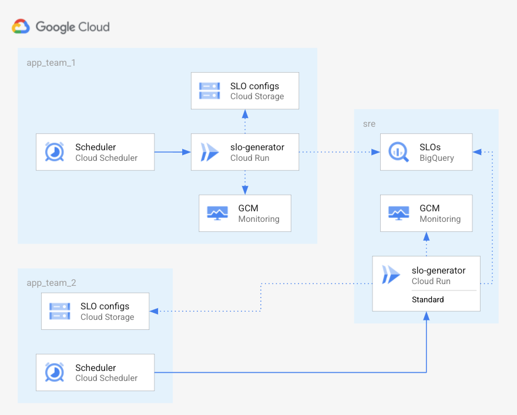

# SRE Service Advanced Example

This example illustrates how to use the `slo-generator` module, when the run
model is as follow:

- **SRE team** runs the `slo-generator` as-a-service; they put it to disposition for application teams to use on request.
- **Team 1** want freedom to compute their SLOs; they want to run their own `slo-generator` service on Cloud Run, and export only the SLOs they care about.
- **Team 2** does not want to bother running their own service; they want to use the SRE team's service.

## Prerequisites

To run this example, you'll need:

- a GCP project (see an example definition [here](../../test/setup/main.tf).
- the IAM role `roles/owner` on the project for the service account running the Terraform.
- the following APIs enabled on the project:
  - cloudscheduler.googleapis.com
  - cloudrun.googleapis.com
  - secretmanager.goolgeapis.com
  - appengine.gooelapis.com
  - compute.googleapis.com

<!-- BEGINNING OF PRE-COMMIT-TERRAFORM DOCS HOOK -->
## Inputs

| Name | Description | Type | Default | Required |
|------|-------------|------|---------|:--------:|
| bigquery\_dataset\_name | BigQuery dataset to hold SLO reports | `string` | `"slo"` | no |
| gcr\_project\_id | Google Container registry project where image is hosted | `string` | `"slo-generator-ci-a2b4"` | no |
| project\_id | SRE Project id | `any` | n/a | yes |
| pubsub\_topic\_name | PubSub topic name | `string` | `"slo-export"` | no |
| region | Region | `string` | `"us-east1"` | no |
| schedule | Cron-like Cloud Scheduler schedule | `string` | `"* * * * */1"` | no |
| slo\_generator\_version | slo-generator image version | `any` | n/a | yes |
| team1\_project\_id | Team 1 project id | `any` | n/a | yes |
| team2\_project\_id | Team 2 project id | `any` | n/a | yes |

## Outputs

| Name | Description |
|------|-------------|
| service\_account\_email | n/a |
| slo-generator | n/a |

<!-- END OF PRE-COMMIT-TERRAFORM DOCS HOOK -->

To provision this example, run the following from within this directory:
- `terraform init` to get the plugins
- `terraform plan` to see the infrastructure plan
- `terraform apply` to apply the infrastructure build
- `terraform destroy` to destroy the built infrastructure
